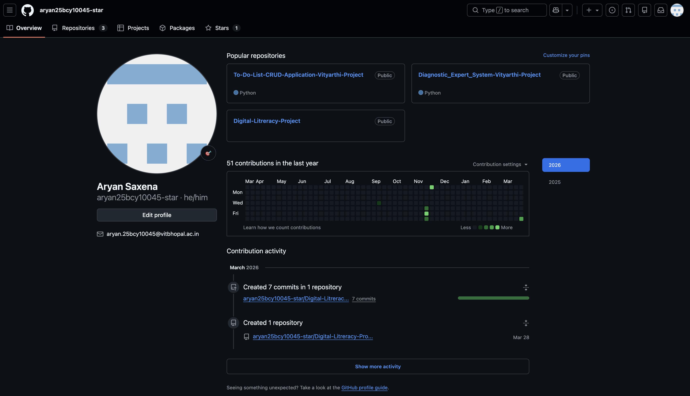
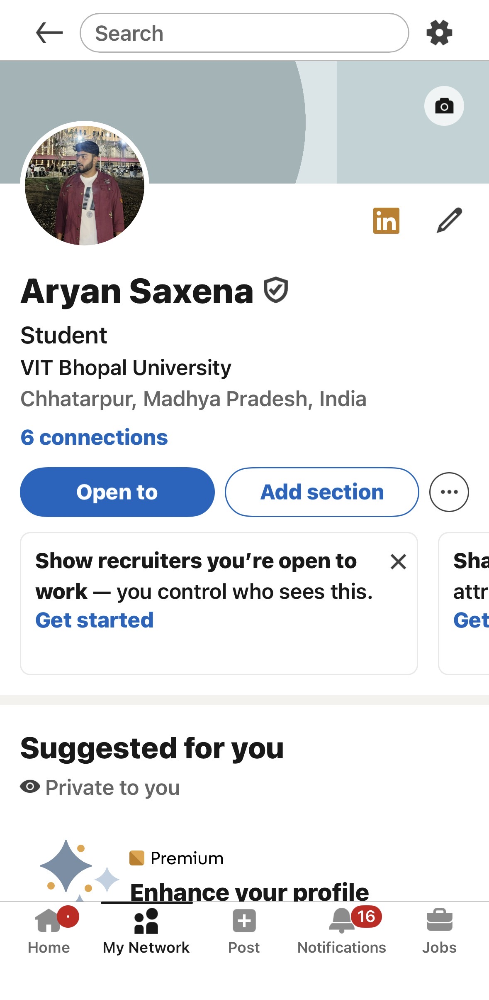
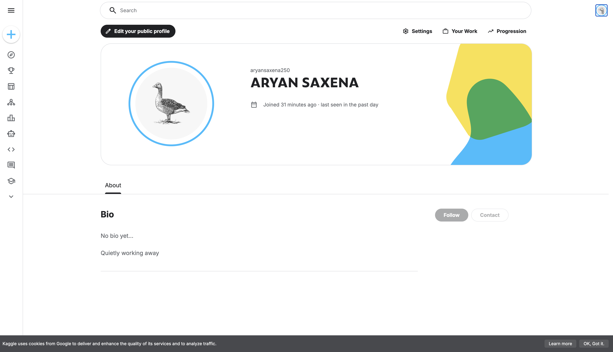

<p align="center">
  <h1 align="center">🌐 Digital Literacy Project – CSE0001VIT Bhopal University | First Year B.Tech</h1>
</p>

---

##  Course & Student Details  

| Field | Details |
|------|--------|
| Course Code | CSE0001 |
| Course Title | Digital Literacy |
| Credits | 1 Credit Pass / Fail (Non-CGPA) |
| Name | Aryan Saxena |
| Registration Number | 25BCY10045 |
| Branch | B.Tech – Computer Science and Engineering (Cyber Security) |
| Year | First Year |

---

##  Project Overview  

This repository contains my Digital Literacy Portfolio, created as a requirement for the CSE0001 course. Based on the scenario of being a Student Digital Ambassador, this project demonstrates my ability to help peers navigate professional online profiles and communicate safely and responsibly in a digital landscape. The portfolio spans five modules, covering visual communication, professional branding, technical collaboration, and cybersecurity awareness.  

---

##  Repository Structure  

```plaintext
digital-literacy-project/
├── README.md                                           # Project overview and navigation 
├── Report/
│   └── Project_Report.pdf                              # Full comprehensive project report
├── Task-1-Presentation/
│   └── Digital Literacy Navigating the Modern Web.png  # Awareness infographic 
├── Task-2-Portfolio/
│   ├── GITHUB.png                                      # Profile README verification 
│   ├── KAGGLE.png                                      # Data science platform setup 
│   └── LINKEDIN.jpeg                                   # Professional networking profile 
├── Task-3-Platforms/
│   ├── Digital Literacy Awareness Quiz (Page-1).png    # Quiz structure 
│   ├── Digital Literacy Awareness Quiz (Page-2).png    # Quiz questions 
│   ├── Digital Literacy Awareness Quiz (RESPONSES).png # Response tracking 
│   ├── HACKER RANK CHALLENGE-1.png                     # Problem-solving proof 
│   └── HACKER RANK CHALLENGE-2.png                     # Score verification 
├── Task-4-Email-Etiquette/
│   ├── Email-1.pdf                                     # Extension request draft 
│   ├── Email-2.pdf                                     # Internship inquiry draft 
│   └── social-media-checklist.md                       # Student etiquette guide 
└── Task-5-Cybercrime/
    ├── casestudy.md                                    # Cybercrime case study writeup 
    └── prevention-checklist.md                         # Cybersecurity prevention guide 
```

---

##  Module Summaries  

### Task 1 – Digital Literacy Awareness Infographic  

<p align="center">
  
</p>

I created a visual resource titled "Digital Literacy: Navigating the Modern Web" to help batchmates understand the importance of digital literacy. The infographic covers safe internet practices, professional online presence, and essential digital tools.  

---

### Task 2 – Building a Student Digital Portfolio  

<p align="center">
  
  
  
</p>

I established foundational professional profiles on GitHub, LinkedIn, and Kaggle. My GitHub includes a personalized profile README with my academic details and learning goals.  

---

### Task 3 – Coding & Collaboration Platforms  

<p align="center">
  
  
</p>

Coding: Completed a beginner challenge on HackerRank to practice technical logic.  
Collaboration: Developed a 5-question Digital Literacy Awareness Quiz using Google Forms to engage with the student community.  

---

### Task 4 – Professional Email & Etiquette Guide  

I drafted two formal emails: one requesting an assignment extension and another inquiring about an internship opportunity. Additionally, I compiled a Social Media Checklist featuring 5 Do's and 5 Don'ts for responsible digital citizenship.  

---

### Task 5 – Cybercrime Awareness Case Study  

I conducted research on Phishing attacks, detailing how they target students and the potential consequences. This is accompanied by an 8-point "Stay Safe Online" prevention guide, specifically including UPI safety tips.  

---

## 💡 About Me  

I am a first-year B.Tech student specializing in Cyber Security at VIT Bhopal University. I am passionate about learning how to protect digital infrastructures and aim to contribute to open-source projects while fostering a secure digital environment for my peers.  

---

## 🔗 Important Links  

- Task 3 Awareness Quiz: [https://forms.gle/QuiPDy9228KKVHVF7]  
- LinkedIn Profile: [https://www.linkedin.com/in/aryan-saxena-2aa31a363/]  
- GitHub Profile: [https://github.com/aryan25bcy10045-star/]  
- Cybercrime Reporting: [https://cybercrime.gov.in/Webform/Accept.aspx]  

---

## 📅 Submission  

Submitted: 30th March 2026  

---

<p align="center">
   <b>End of Digital Literacy Portfolio</b> 
</p>
